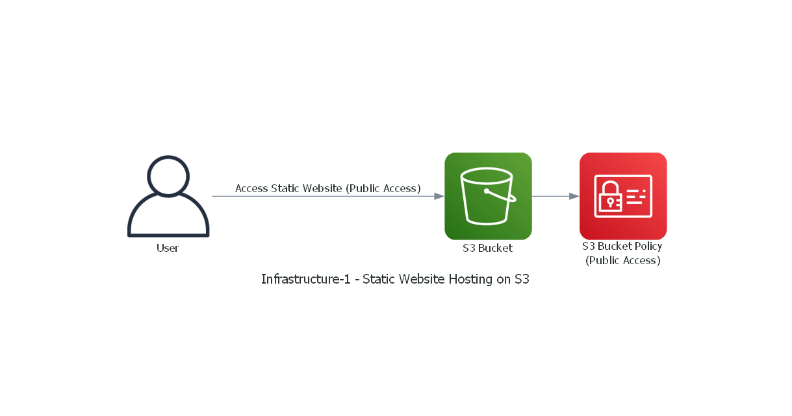
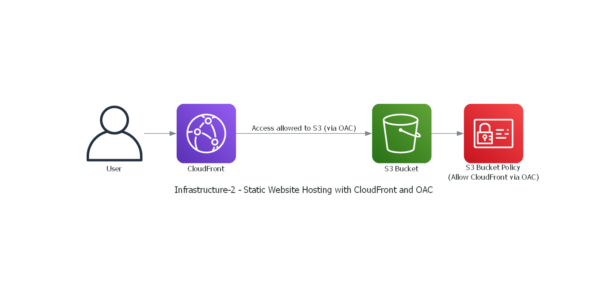
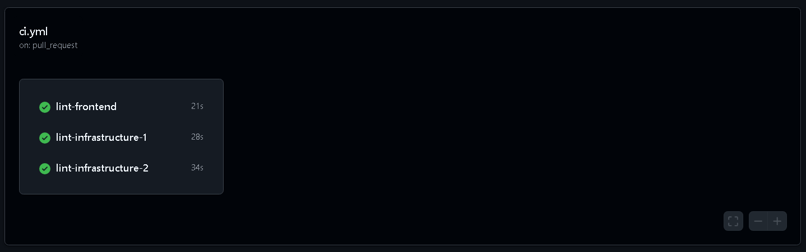
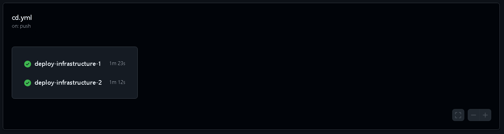

# Dev Mood App 🌟

**Dev Mood** is a web application designed to enhance a developer's coding experience. It offers a combination of dev quotes, coding music, weather information, and a beautiful, responsive UI to keep developers motivated and focused. The app leverages modern cloud infrastructure and CI/CD practices to ensure seamless deployment and scalability. 🚀

## Frontend 🖥️

The frontend of the Dev Mood app is built using **Next.js** and **Tailwind CSS** to create a dynamic and highly responsive user experience. The key features of the app include:

- **Dev Quotes** 💬: A curated collection of inspiring developer quotes to motivate you during your coding sessions.
- **Coding Music 🎶**: A selection of background music designed to help you stay focused and productive while coding.
- **Weather Info 🌤️**: Real-time weather updates based on your location to help plan your day.
- **Responsive Design 📱**: A modern and user-friendly design that adapts to various screen sizes and devices.

### Technologies Used:
- **Next.js** (for server-side rendering and optimized performance)
- **Tailwind CSS** (for fast, utility-first styling)

---

## Infrastructure - Static Website Hosting with S3 (Infrastructure-1) 🌐

### Overview:
The app is hosted on **Amazon S3** using its static website hosting feature. This setup is simple, cost-effective, and scalable, making it ideal for hosting static assets like HTML, CSS, and JavaScript files. The infrastructure is managed and deployed using **Pulumi**, an Infrastructure as Code (IaC) tool.

### Key Components:
- **S3 Bucket**: Used to store the static website files (HTML, CSS, JS).
- **Static Website Hosting**: Configured to serve the website with an index and error document.
- **Bucket Policy**: Allows public access to the static assets for users to view the site.

The S3 bucket provides a simple, cost-effective solution for hosting the frontend, ensuring fast content delivery globally.

### Preview for Infrastructure-1 🌐:
<a href="http://dev-mood-1-bucket-81bfedd.s3-website-us-east-1.amazonaws.com/" target="_blank">Infrastructure-1 Preview</a>

### Diagram for Infrastructure-1:

---

## Infrastructure - Static Website Hosting with S3, CloudFront, and OAC (Infrastructure-2) ⚡

### Overview:
The app is also hosted using **Amazon S3**, but this time with an added **CloudFront CDN** and **Origin Access Control (OAC)** for enhanced performance and security. CloudFront caches content at edge locations to deliver the site faster to users across the globe. This infrastructure is also managed and deployed using **Pulumi**.

### Key Components:
- **S3 Bucket**: Stores static files, but with public access restricted to CloudFront only.
- **CloudFront CDN**: Caches and delivers static content globally, improving load times and providing HTTPS security.
- **OAC (Origin Access Control)**: Ensures that only CloudFront can access the S3 bucket, providing an additional layer of security.
- **Bucket Policy**: Allows CloudFront to access the S3 files securely.

This setup is more secure and optimized for performance, ensuring your app loads quickly regardless of where your users are located.

### Preview for Infrastructure-2 ⚡:
<a href="https://d2y1cy8163fewy.cloudfront.net" target="_blank">Infrastructure-2 Preview</a>

### Diagram for Infrastructure-2:

---

## Continuous Integration (CI) 🔄

The **CI pipeline** ensures that code is continuously linted and checked for quality with each pull request. It lints the frontend, **Infrastructure-1**, and **Infrastructure-2** code to ensure consistency and catch errors early in the process. Here's how it works:

### Steps:
1. **Code Checkout**: Pulls the latest code from the repository.
2. **Node.js Setup**: Installs the latest version of Node.js (v18).
3. **Linting**: Runs the linting process to catch any coding errors or style violations before merging to the main branch.

### Technologies Used:
- **GitHub Actions**: Automates the linting process with pull request triggers.
- **ESLint**: Used for linting the frontend and infrastructure code.

### Benefits:
- 🚀 Ensures consistent code quality.
- 🛠️ Prevents errors from entering the main branch.
- 🔧 Automatically checks code on every pull request.

### CI Workflow:

---

## Continuous Deployment (CD) 🚀

The **CD pipeline** automates the deployment of the application whenever there is a push to the main branch. It deploys **Infrastructure-1** (Static Website Hosting with S3) and **Infrastructure-2** (Static Website Hosting with S3, CloudFront, and OAC). Here's how the process works:

### Steps:
1. **Code Checkout**: Pulls the latest code from the repository.
2. **Static Website Build**: Builds the static website assets from the frontend.
3. **AWS Credentials Configuration**: Configures AWS access keys for secure deployment.
4. **Deploy Infrastructure-1 via Pulumi**: Deploys **Infrastructure-1** by uploading the static website files to the S3 bucket.
5. **Deploy Infrastructure-2 via Pulumi**: Deploys **Infrastructure-2** by uploading the static website files to the S3 bucket, while ensuring CloudFront and OAC are properly configured for enhanced security and performance.

### Technologies Used:
- **GitHub Actions**: Automates the deployment process.
- **Pulumi**: Infrastructure as Code (IaC) tool used to manage and deploy the cloud resources.
- **AWS S3** and **CloudFront**: For hosting and serving the static content globally.

### Benefits:
- 🎯 Fast, reliable deployments with zero downtime.
- 🌍 Global content delivery via CloudFront.
- 🔒 Secure deployment with AWS credentials and best practices.

### CD Workflow:

---

Feel free to check out the repo and contribute! 🌟